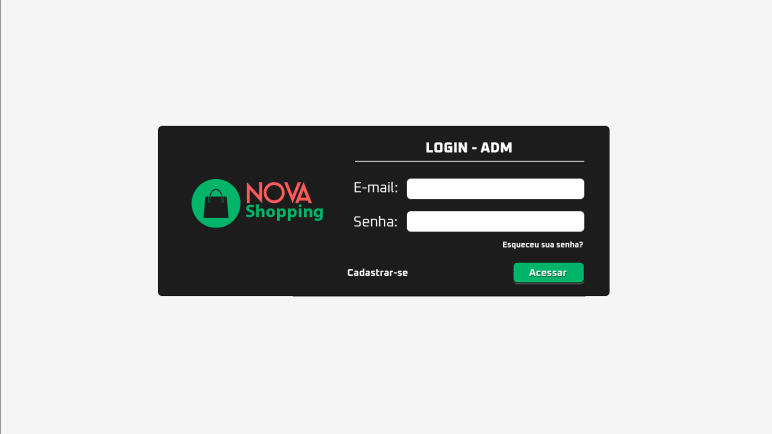
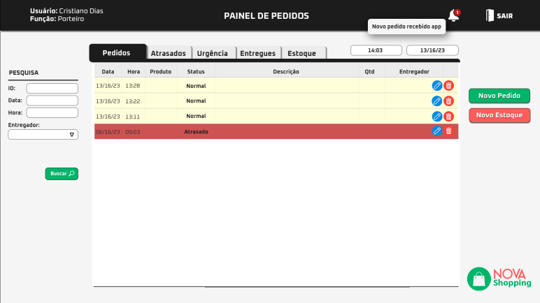
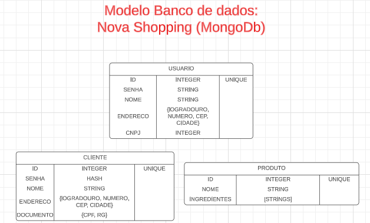

# Nova Shopping : Sistema de entregas web

## Tecnologias utilizadas:

    

## Estrutura do Projeto

1. Página de Login
    - Requisição Assíncrona HTTP
    - Conexão remota com Banco de Dados
    - Validação de login
    - Criação de cookie para permanecer conectado
2. Página de Pedido
    1. Aba Pedidos:
       - Verificar pedidos em andamento
       - Editar pedidos
       - Validar pedidos pendentes
    2. Aba Entregues:
        - Sistema de consulta no BD :
            - por data
            - por produto
            - por entregador
            - por cliente
    3. Aba Estoque:
        - Lista de produtos em estoque
        - Sistema de consulta no BD :
            - por produto
            - por quantidade (prestes a acabar)
        - Editar produtos
3. Banco de Dados (MongoDb - NoSql)
    - Modelagem do banco
    - Criação dos Schemas Json
    - Criação das coleções

### Página de Login



A imagem acima é o modelo que pretendemos seguir para a elaboraçao do layout da pagina de Login.

### Página de Pedidos



A imagem acima é o modelo que pretendemos seguir para a elaboraçao do layout da pagina de Pedidos.

### Modelo do Banco de Dados



O banco de dados MongoDb é NoSql o que implica que sua utilização não esta necessariamente sujeita a regras de relacionamente ou a estruturas pré-definidas das coleções. Entretanto, para garantir um certa integridade dos dados e um bom funcionamento do sistema é sempre interessante garantir que algumas informações imprescindíveis estejam presentes dentro do banco de dados e para tanto é necessario utilizar Schemas Json.

[Acesse o codigo](https://github.com/iniciativa-dev/Projeto2IntermediarioEquipe2/tree/main/jsonSchema_validator_NovaShopping.txt)

```
use novaShoppingDb

db.createCollection(
	"usuario",
	{validator:{$jsonSchema:{
		required:["id_usuario", "senha", "nome", "endereco", "cnpj"],
		properties: {
			id_usuario: {
				bsonType: "int",
				description: "O campo id deve ser informado"
			},
			senha: {
				bsonType: "string",
				description: "A senha tem que ser haseada"
			},
			endereco: {
				bsonType: "object",
				description: "Insira logradouro, numero, cep, cidade",
				required: ["logradouro", "numero", "cep", "cidade"],
					properties: {
						cep: {
							bsonType: "int",
							description: "O cep nao pode conter hifen",
							minLength: 8,
							maxLength: 8
						}
					}
			},
			cnpj: {
				bsonType: "int",
				description: "Para ser cliente é preciso ter um CNPJ",
				minLength: 14,
				maxLength: 14
			}
		} 
}}})
	
db.createCollection(
	"cliente",
	{validator:{$jsonSchema:{
		required:["id_cliente", "senha", "nome", "endereco", "documentos"],
		properties: {
			id_cliente: {
				bsonType: "int",
				description: "O campo id deve ser informado"
			},
			senha: {
				bsonType: "string",
				description: "A senha tem que ser haseada"
			},
			endereco: {
				bsonType: "object",
				description: "Insira logradouro, numero, cep, cidade",
				required: ["logradouro", "numero", "cep", "cidade"],
					properties: {
						cep: {
							bsonType: "int",
							description: "O cep nao pode conter hifen",
							minLength: 8,
							maxLength: 8
						}
					}
			},
			documentos: {
				bsonType: "object",
				description: "Insira Rg e Cpf",
				required: ["rg", "cpf"],
					properties: {
						cpf: {
							bsonType: "int",
							description: "O cpf nao pode conter hifen",
							minLength: 11,
							maxLength: 11
						}
					}
			}
		} 
}}})

db.createCollection(
	"produto",
	{validator: {$jsonSchema: {
		required: ["id_produto", "nome", "ingredientes"],
		properties: {
			id_produto: {
				bsonType: "int",
				description: "O campo id deve ser informado"
			},
			ingredientes:{
				bsonType: "array",
				description: "O numero de ingredientes é livre"
			}
		}
	}
}})
```
